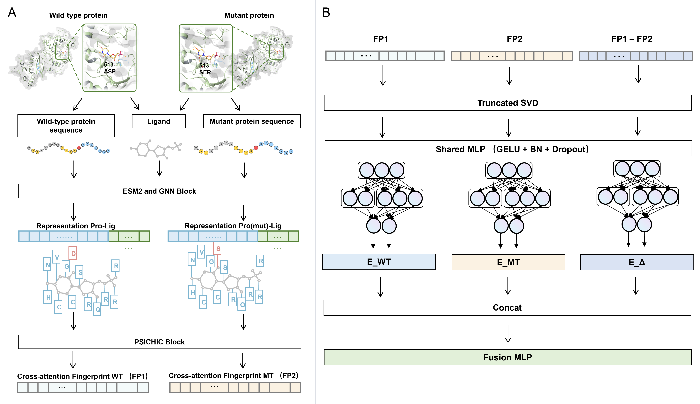

# PSeMut: Mutation-Aware, Structure-Free Prediction of Ligand-Sensitive Effects

PSeMut is a practical pipeline for predicting how specific protein point mutations alter interactions with given small-molecule ligands, without requiring experimental 3D structures. It combines the PSICHIC backbone (a protein-small molecule GNN that generates interpretable interaction fingerprints from sequence and SMILES) with a lightweight three-branch Siamese regressor trained on [mutant, wild-type, difference] features. A symmetry-aware "exchange consistency" loss enforces equal and opposite predictions when swapping mutant/wild-type and negating the difference branch, improving identifiability and robustness. This repository provides end-to-end scripts for dataset construction, training, baselines/ablations, ensemble inference, and analysis.



## Project Directory Structure

```
PSeMut-main/
├── Dataset/                    # Datasets
│   ├── training/               # Training data (processed)
│   │   ├── train.csv
│   │   ├── val.csv
│   │   ├── test.csv
│   │   ├── split_info.json
│   │   └── siamese_pairs/      # Three-branch fingerprints
│   │       ├── train/siamese_fingerprints.npy
│   │       ├── val/siamese_fingerprints.npy
│   │       └── test/siamese_fingerprints.npy
│   └── screening/              # Screening data
│       ├── LB_origin.csv       # Compound library for screening
│       └── LB_psemutResult.csv # Screening results
├── weight/                     # Trained model weights
│   ├── seed_42/
│   ├── seed_123/
│   └── seed_456/
├── Ablation/                   # Ablation study results
├── models/                     # Model definitions
├── utils/                      # Utility functions
├── dl_trainers/                # Training and inference scripts
└── scripts/                    # Analysis and baseline scripts
```

---

## Environment Setup

### Method 1: Conda Quick Installation (Recommended)

```bash
# 1. Clone the repository
git clone https://github.com/shenzheyuan2020/PSeMut.git
cd PSeMut

# 2. Create environment
# GPU version (requires NVIDIA driver and CUDA)
conda env create -f environment_gpu.yml

# Or CPU version
conda env create -f environment_cpu.yml

# 3. Activate environment
conda activate psemut
```

### Method 2: Manual Installation

```bash
# Install PyTorch (according to your CUDA version)
# Example: CUDA 11.7
pip install torch==2.0.0

# Install PyTorch Geometric and dependencies
pip install torch-scatter torch-sparse torch-cluster torch-spline-conv torch-geometric

# Install other dependencies
pip install -r requirements.txt
```

---

## Quick Start: Screening with Pre-trained Models

### Scenario: Predict BRAF V600E Mutation Effects on Compound Library

```bash
python dl_trainers/predict_siamese_exchange_ensemble.py \
  --input_csv Dataset/screening/LB_psichicResult.csv \
  --weights_root weight \
  --psichic_weights_dir weight/trained_weights \
  --psichic_model_name "Trained on PDBBind v2020" \
  --output_dir dl_siamese_infer \
  --use_gpu
```

**Description:**
- WT sequence: BRAF wild-type
- MUT sequence: BRAF V600E mutation
- Model: Uses trained ensemble models

---

## Training Models from Scratch (Advanced)

### 1. Data Preparation

If you have your own mutation data, you need to first build the three-branch dataset:

```bash
# Generate PSICHIC fingerprints
python fp.py \
  --input_csv your_mutation_data.csv \
  --output_dir psichic_results

# Build Siamese dataset
python build_siamese_dataset.py \
  --csv_file your_mutation_data.csv \
  --result_path psichic_results \
  --output_dir data/processed/siamese
```

**CSV Format Requirements:**
- Required columns: `UNIPROT_ID`, `SMILES`, `Protein`, `Ligand`, `LABEL`
- `Protein`: Protein sequence
- `Ligand`: SMILES string
- `LABEL`: Activity value (e.g., pIC50, pKd, etc.)

### 2. Train PSeMut Model

```bash
python dl_trainers/train_siamese_exchange.py \
  --data_dir Dataset/training \
  --output_dir outputs/dl/psemut_training \
  --seeds 42,123,456 \
  --use_gpu \
  --epochs 150 \
  --batch_size 256 \
  --lr 1e-3 \
  --weight_decay 1e-4 \
  --dropout 0.2 \
  --exchange_consistency \
  --consistency_weight 0.1 \
  --enable_multitask \
  --cls_weight 0.2 \
  --svd_dim 384 \
  --early_stopping_patience 30
```

**Key Parameters:**
- `--data_dir`: Data directory containing siamese_pairs/
- `--exchange_consistency`: Enable exchange consistency loss (crucial!)
- `--enable_multitask`: Enable directional classification head
- `--svd_dim 384`: SVD dimension per branch (optimal configuration from paper)

### 3. Predict with Trained Models

```bash
python dl_trainers/predict_siamese_exchange_ensemble.py \
  --input_csv your_test_data.csv \
  --weights_root outputs/dl/psemut_training \
  --output_dir prediction_results \
  --use_gpu
```

---

## Reproducing Paper Experiments

### Run All Baseline Models

```bash
python run_all.py \
  --data_dir Dataset/training \
  --out_root outputs/benchmarks/all \
  --svd_dim 384 \
  --seeds 42,123,456 \
  --use_xgb \
  --use_gpu
```

### Ablation Studies

The project includes all ablation study results in the `Ablation/` directory:
- `model_base/` - Full PSeMut model
- `model_no_exchange/` - Without exchange consistency
- `model_diff_only/` - Difference branch only
- `model_mut_only/` - Mutant branch only
- `model_wt_only/` - Wild-type branch only
- `baselines_seed_*/` - Traditional machine learning baselines

---

## License

This project is licensed under the license specified in the [LICENSE](LICENSE) file.

---

## Contact

For questions or suggestions, please submit an Issue or contact the project maintainers.

